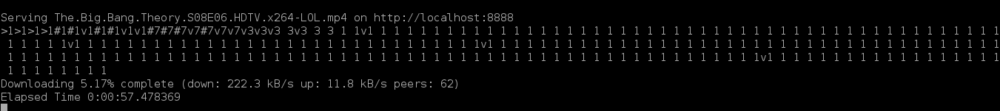

Touchandgo
==========

A python app and library to watch series and movies magically

Read the full docs at http://touchandgo.rtfd.org

How to install
--------------

::

  sudo apt-get install python-libtorrent libxml2-dev libxslt1-dev python-lxml (or the name of the package on your
  linux distro)
  pip install touchandgo
  (pip needs python-dev package to compile some libraries. If you don't 
  have installed run "sudo apt-get install python-dev")
  if you have problems compiling lxml even with all the packages installed you
  shoud try to install it like this: 
  
  CFLAGS="-O0" pip install touchandgo

How to use
----------

::

  touchandgo [series name] [season] [episode]
 
  E.g.:  touchandgo Crisis 1 5
         touchandgo "true blood" 7 10
         touchandgo "true blood" 7 10 --sub spa
         touchandgo "never ending story"

How to run streaming proxy
--------------------------

In the computer

::

  tsproxy 

In your video player open http://<server address>:5000/crisis/1/5

just enjoy it.

If you run Touchandgo in debug mode (with --verbose), 
You will see this (see the screenshot)that we call"defrag". 
Defrag shows the current pieces status.

* The number shows the piece priority. 1 is the lowest and 7 the highest.
* v means that the piece is downloading.
* # means that the piece is downloaded.
* > means that the piece was served by http.

Join the discussion
-------------------
touchandgo-devs@googlegroups.com or https://groups.google.com/forum/#!forum/touchandgo-devs
