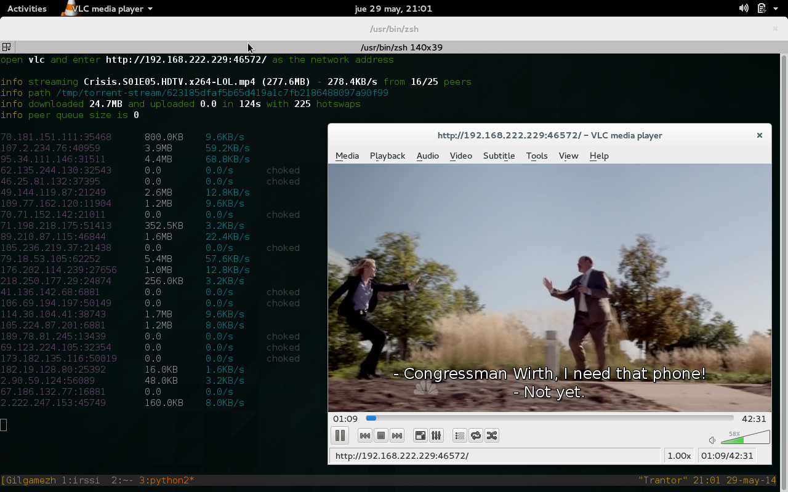

Touchandgo
==========
A python app and library to watch series and movies magically

How to install
--------------

::

  sudo apt-get install python-libtorrent (or the name of the package on your
  linux distro. We are using libtorrent >= 0.16)
  pip install touchandgo

How to use
----------

::

  touchandgo [series name] [season] [episode]
 
  E.g.:  touchandgo Crisis 1 5
         touchandgo "true blood" 7 10
         touchandgo "true blood" 7 10 --subtitles spa
         touchandgo "never ending story"

How to run streaming proxy
--------------------------

In the computer

::

  tsproxy 

In your video player open http://<server address>:5000/crisis/1/5

just enjoy it.

